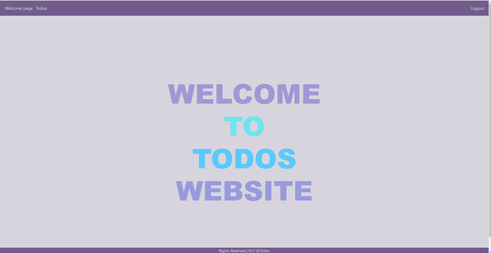
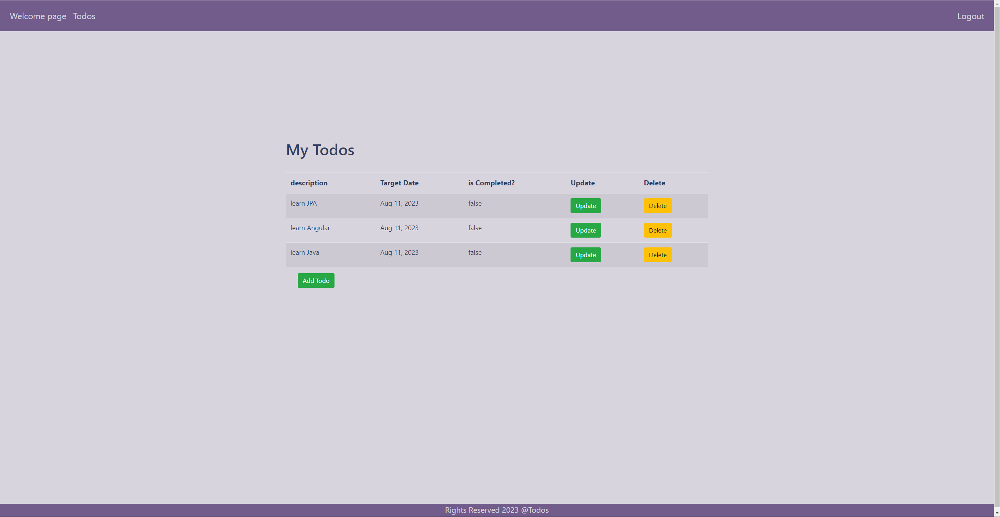
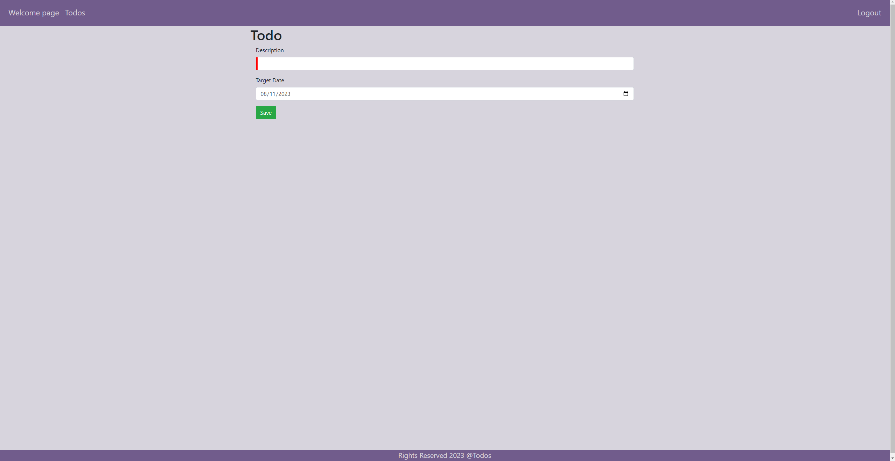
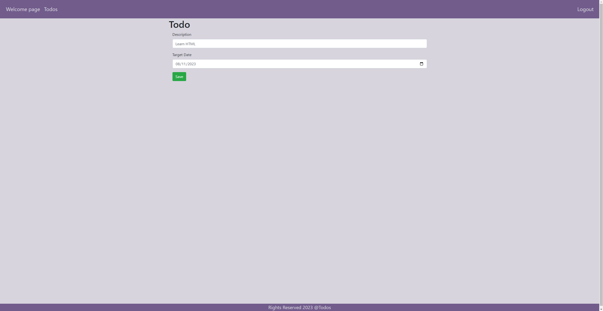
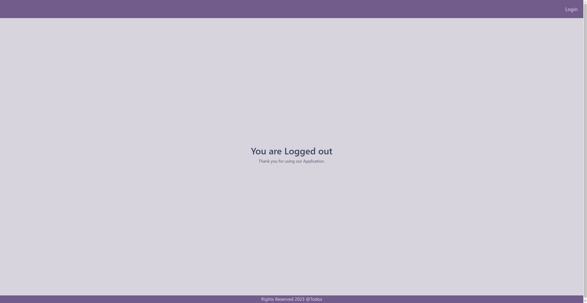
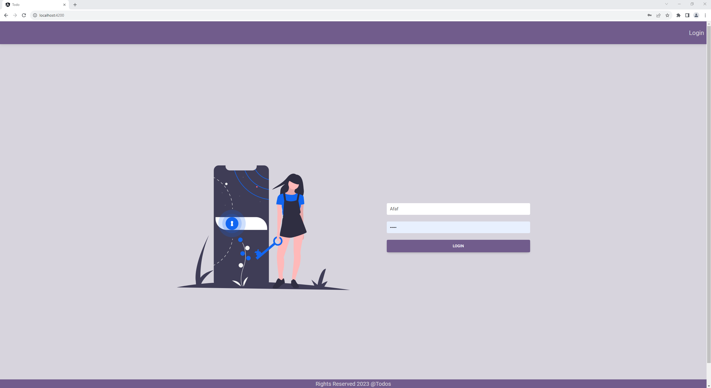

<h1><span style="font-style:italic; color: rgb(158, 81, 124);">Todo</span>:rocket:</h1>
<p style="font-size: 25px; color: white;" >This is a full-stack project - a Todo List website built using Angular and Spring Boot! It was quite a challenge for me to deploy the project on GitHub Pages, as I had never used GitHub before. However, I learned a lot through this experience and am proud of what I've accomplished.</p>

<h2 style="font-style:italic; color: rgb(158, 81, 124);">Technologies Used :rocket:</h2>
<ul style="font-size: 25px; color: white;" >Spring Boot</ul>
<ul style="font-size: 25px; color: white;" >Angular</ul>

<h2 style="font-style:italic; color: rgb(158, 81, 124);">Project Overview  :rocket:</h2>
<p style="font-size: 25px; color: white;" >The Todo List website allows users to manage their tasks and stay organized. It provides features to add, edit, and delete tasks. The project utilizes Angular on the frontend and Spring Boot on the backend.</p>

<h2 style="font-style:italic; color: rgb(158, 81, 124);">Demo  :rocket:</h2>
Check out the live demo of the project <a href="https://afaf99.github.io/Todos/">here</a>


# Todo List
<a name="readme-top"></a>

<!-- TABLE OF CONTENTS -->
<details>
  <summary>Table of Contents</summary>
  <ol>
    <li><a href="#Description-of-the-project">Description of the project</a></li>
    <li> <a href="#Setup">Setup</a> </li>
    <li><a href="#Technologies-Used">Technologies Used</a></li>
    <li><a href="#Project Overview">Project Overview </a></li>
    <li><a href="#Demo">Demo</a></li>
 
  </ol>
</details>


<!-- ABOUT THE PROJECT -->
## Description of the project

<p>This is a full-stack project - a Todo List website built using Angular and Spring Boot! It was quite a challenge for me to deploy the project on GitHub Pages, as I had never used GitHub before. However, I learned a lot through this experience and am proud of what I've accomplished./p>


<p align="right">(<a href="#readme-top">back to top</a>)</p>

<!-- GETTING STARTED -->
## Setup
<ul>
## Prerequisites

**Clone the repo**
   ```sh
   git clone https://github.com/afaf99/Todos.git
   ```
- Java 19
- Angular
-  Create a MySQL database and update the database configuration in `application.properties` with your database credentials:
# JWT Configuration
- jwt.signing.key.secret=mySecret
- jwt.get.token.uri=/authenticate
- jwt.refresh.token.uri=/refresh
- jwt.http.request.header=Authorization
- jwt.token.expiration.in.seconds=604800

# Database Configuration
- spring.datasource.url=jdbc:h2:mem:testdb;NON_KEYWORDS=USER
- spring.h2.console.path=/h2-console
- spring.h2.console.enabled=true
- spring.jpa.defer-datasource-initialization=true
- spring.data.jpa.repositories.bootstrap-mode=default

</ul>


## Technologies Used

This project is built using a range of technologies and tools:

- **Java Persistence API (JPA)**: Used for managing entities and database relationships.
- **Jakarta Persistence**: Annotations like `@Entity` are used for entity mapping.
- **Lombok**: Employed to reduce boilerplate code and enhance code readability.
- **Database**: H2.
- **APIs/Web Scraping**: Data enrichment is achieved through external data sources.
- **Spring Boot**: The Spring framework is utilized for the backend development.
- **Angular**: Angular is used for the frontend development.

These technologies work in harmony to power the system's functionality and provide a robust user experience.

<p align="right">(<a href="#readme-top">back to top</a>)</p>


<!-- ROADMAP -->
## Project Overview 
- The Todo List website allows users to manage their tasks and stay organized. It provides features to add, edit, and delete tasks. The project utilizes Angular on the frontend and Spring Boot on the backend.

<p align="right">(<a href="#readme-top">back to top</a>)</p>


##Demo
 
 
 
 
 
 


[](https://drive.google.com/uc?id=VIDEO_ID)


<p align="right">(<a href="#readme-top">back to top</a>)</p>


